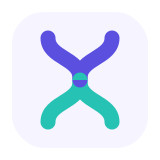

# YoYui

**YoYui** is an internal fork of [PrimeReact](https://v10.primereact.org), maintained by **Orcado**.

## Why this fork exists

We rely on PrimeReact across our products and maintain this fork internally to manage our own patches, customizations, and release cadence, independent of the upstream project's roadmap.

## License

**Existing MIT versions remain MIT, forever.**

This fork is built on the original PrimeReact codebase, released under the MIT license. That license is preserved in full — nothing about the existing MIT-licensed code is taken away or restricted. See [LICENSE](./LICENSE) for details, including both the original and Orcado copyright notices.

## Contributing

This is an internal Orcado project. Contributions are currently limited to Orcado employees — see [CONTRIBUTING.md](./CONTRIBUTING.md) for details.

## Credit

This project builds on the work of the original PrimeReact / PrimeTek team. Thank you to everyone who built, maintained, and contributed to the library over the years.
